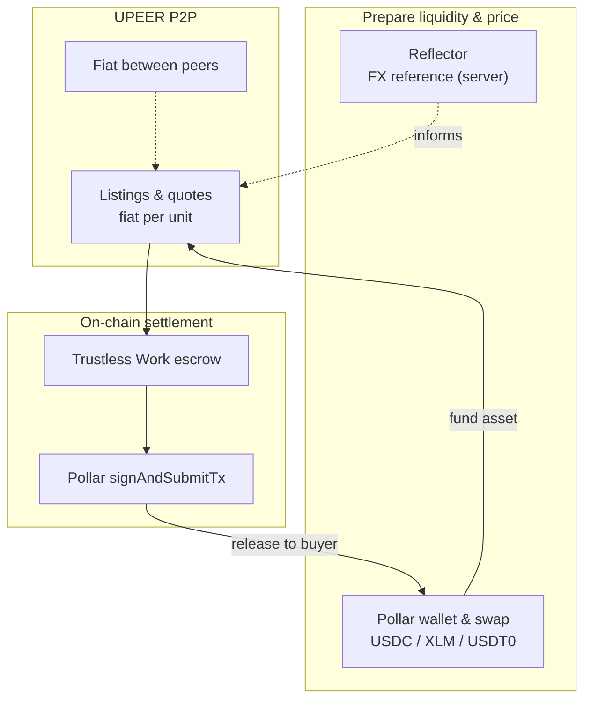

# UPEER documentation

Start here if you need more than the repo [README](../README.md).

| Document | Type | You will use it when… |
| --- | --- | --- |
| [What UPEER does](./product.md) | Conceptual | You need the product model, **settlement assets** (USDC/XLM/USDT0), **Brazil PIX**, coverage, and P2P vs provider ramp |
| [How a trade works](./how-a-trade-works.md) | How-to | You run a two-wallet test trade step by step |
| [Architecture](./architecture.md) | Reference | You integrate, deploy, or debug backends and external services |
| [User flows](./user-flows.md) | Reference | You need journey diagrams (Mermaid) for onboarding, market, and settlement |

### P2P integrations (Reflector, Pollar, Trustless Work)

| Document | You will use it when… |
| --- | --- |
| [Reflector Pulse](./integration-reflector.md) | Explaining LATAM FX reference reads, quote snapshots, and how pricing relates to the order book |
| [Pollar](./integration-pollar.md) | Explaining login, wallet, swap wiring, and escrow signing |
| [Trustless Work](./integration-trustless-work.md) | Explaining single-release escrow phases and the BFF ↔ TW ↔ Pollar loop |

**Code references**

- Fiat markets and rails: `lib/fiat/coverage.ts`, `lib/fiat/rail-details.ts`
- Settlement assets and Trustless Work trustlines: `lib/settlement/assets.ts`
- Escrow deploy trustline: `app/api/escrow/deploy/route.ts`

Diagrams in this folder use [Mermaid](https://mermaid.js.org/). GitHub renders fenced `mermaid` blocks in Markdown previews.
