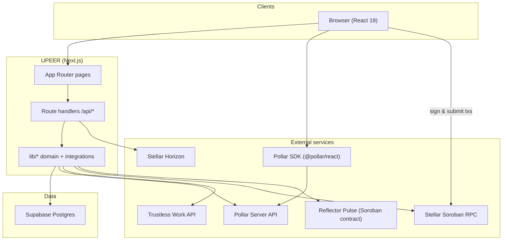
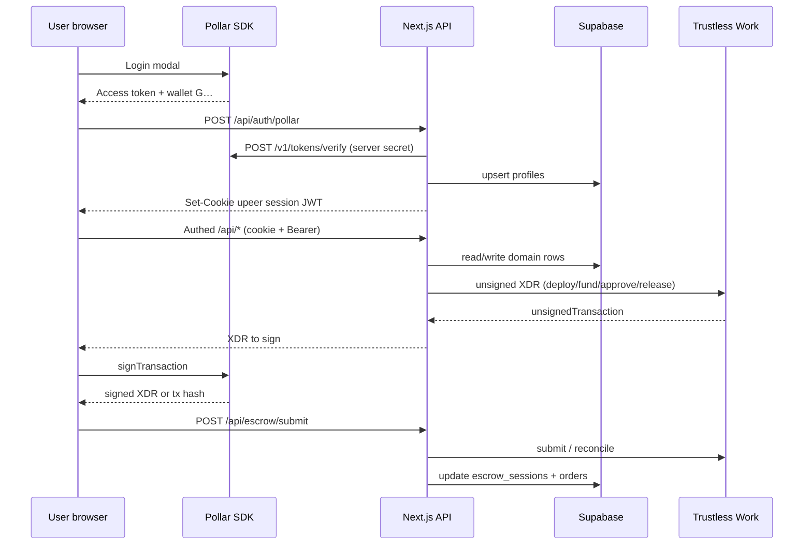
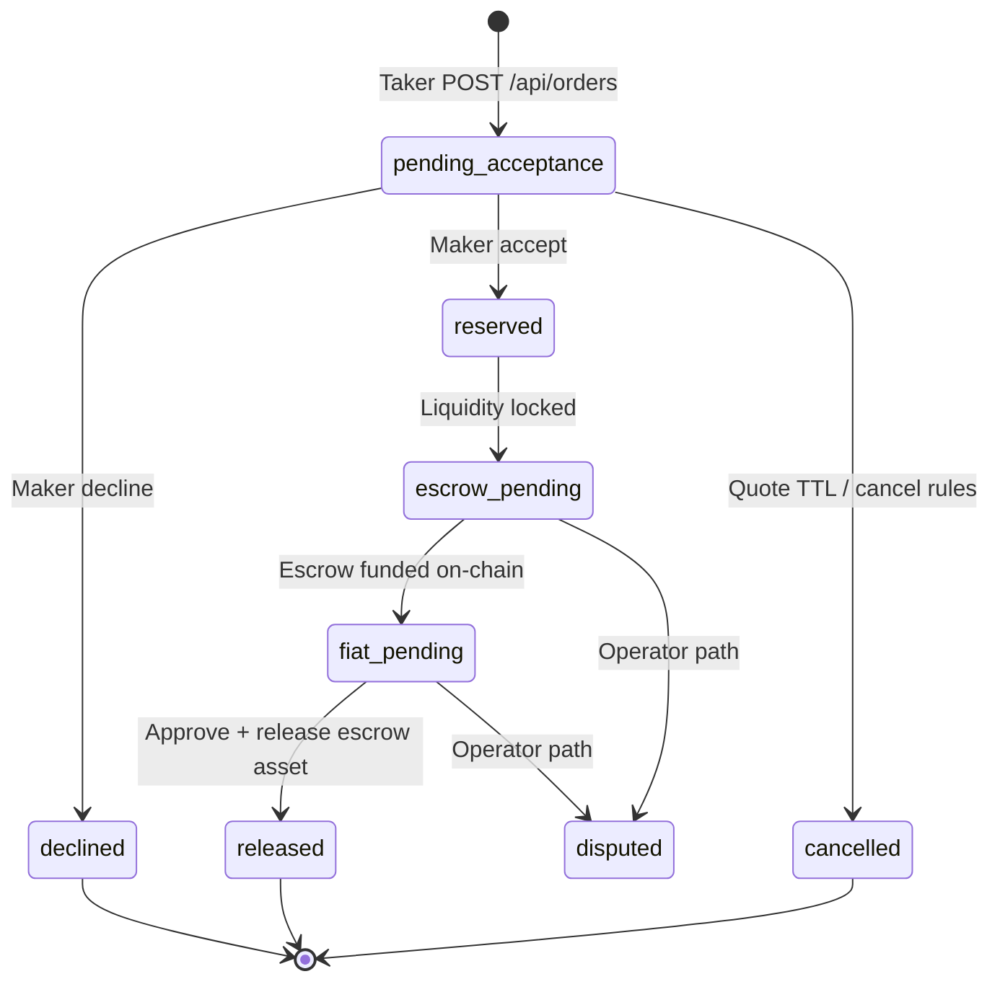
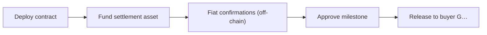

# Architecture

UPEER is a Next.js App Router app. The browser talks to same-origin route handlers (BFF). Secrets stay on the server. Pollar signs Stellar transactions in the client. Trustless Work builds unsigned escrow XDRs. Supabase Postgres holds profiles, offers, quotes, orders, and escrow session state.

For product language see [What UPEER does](./product.md). For click-by-click testing see [How a trade works](./how-a-trade-works.md). For journey charts see [User flows](./user-flows.md).

## System context

## Integration map

The table lists where each product connects in this repo and which env vars gate it.

| Product | Role in UPEER | Code touchpoints | Configuration |
| --- | --- | --- | --- |
| **Pollar** | Embedded wallet, login, balance, send, swap | `components/providers/app-providers.tsx`, `lib/pollar/*`, `components/wallet/*`, order detail signing | `NEXT_PUBLIC_POLLAR_PUBLISHABLE_KEY`, `POLLAR_SECRET_KEY`, optional `POLLAR_SERVER_URL` |
| **Supabase** | Profiles, merchants, offers, quotes, orders, notifications, escrow rows | `lib/supabase/server.ts`, `lib/db/*`, most `app/api/*` | `NEXT_PUBLIC_SUPABASE_URL`, `NEXT_PUBLIC_SUPABASE_PUBLISHABLE_KEY`, `SUPABASE_SERVICE_ROLE_KEY` |
| **Trustless Work** | Single-release escrow deploy, fund, approve, release | `lib/trustless-work/client.ts`, `app/api/escrow/*`, `components/orders/order-detail/*` | `TRUSTLESS_WORK_API_KEY`, `UPEER_PLATFORM_ADDRESS`, optional `UPEER_PLATFORM_FEE_BPS` |
| **Stellar** | Settlement assets (USDC, XLM, USDT0), contract execution, explorers | `lib/config/network.ts`, `lib/settlement/assets.ts`, `lib/stellar/*`, `lib/escrow/on-chain.ts` | `STELLAR_NETWORK` / `NEXT_PUBLIC_STELLAR_NETWORK`, `STELLAR_MAINNET_RPC_URL` on mainnet |
| **Reflector Pulse** | Optional LATAM FX reference for `/api/prices/reference` and quote snapshots | `lib/reflector/pulse.ts`, `app/api/prices/reference/route.ts` | `REFLECTOR_PULSE_CONTRACT_ID`, `REFLECTOR_RPC_URL`, `REFLECTOR_PUBLIC_KEY` |

Fiat rails (SINPE, PIX, Nequi, Mercado Pago, and so on) are not integrated bank APIs for the P2P book. Users exchange payment details stored in `profiles.payment_prefs` (`lib/fiat/coverage.ts`, `lib/fiat/rail-details.ts`) and confirm in the app.

Optional **licensed ramps** (BRL → USDC in-wallet) are out of band: [LATAM Ramp Kit](https://github.com/armandocodecr/latam-ramp-kit) with server-side provider keys. UPEER only shows a wallet teaser when `NEXT_PUBLIC_ENABLE_RAMP_KIT=true`; it does not replace P2P settlement on orders.

## Request path (BFF)

Session details:

- Cookie name and JWT signing live in `lib/auth/session.ts` (`UPEER_SESSION_SECRET`).
- The client also stores a short-lived session object in `localStorage` (`lib/upeer-api.ts`) for Bearer headers on `fetch`.
- `requireSession` in `lib/auth/require-session.ts` guards protected API routes.

## Order and escrow state

Milestone strings on `escrow_sessions` (for example `deploy_unsigned`, `funded`) refine UI progress while `orders.status` stays `escrow_pending` or `fiat_pending`. See `lib/orders/format.ts` (`formatOrderProgress`).

On-chain seller vs buyer follows offer side in `lib/escrow/p2p-legs.ts`, not “who posted first.” Escrow asset comes from `offers.settlement_asset`, snapshotted on `quotes.settlement_asset` at take time.

## Trustless Work escrow phases

| Phase | API route | Who signs |
| --- | --- | --- |
| Deploy | `POST /api/escrow/deploy` | On-chain seller |
| Fund | `POST /api/escrow/fund` | On-chain seller |
| Submit signed tx | `POST /api/escrow/submit` | Same signer (or wallet-submitted hash) |
| Status / on-chain poll | `GET /api/escrow/status` | — |
| Approve | `POST /api/escrow/approve` | On-chain seller |
| Release | `POST /api/escrow/release` | On-chain seller |

Deploy builds `trustline` from `lib/settlement/assets.ts` (`trustlinePayloadForAsset`). Issued assets use Circle USDC or USDT0 mainnet issuer; XLM uses the native SAC contract id on the active network.

Platform operator Stellar address `UPEER_PLATFORM_ADDRESS` is passed into Trustless Work deploy payloads as an escrow role, not as the end-user wallet.

## API surface (grouped)

All paths are under `/api`. Unless noted, routes require a UPEER session.

| Group | Routes | Notes |
| --- | --- | --- |
| Health | `GET /health` | Public; integration flags only |
| Auth | `POST /auth/pollar`, `POST /auth/logout` | Pollar token exchange |
| Profile | `GET /me`, `POST /onboarding`, `POST /me/avatar` | Onboarding sets `platformIntent` |
| Market | `GET /offers`, `POST /offers` | Open book + post order (`settlementAsset` on POST) |
| Quotes | `POST /quotes` | Locks price/size before order |
| Orders | `GET/POST /orders`, `GET /orders/[id]`, `POST accept/decline/confirm` | P2P lifecycle |
| Escrow | `deploy`, `fund`, `submit`, `approve`, `release`, `status`, `resolve`, `probe` | Trustless Work bridge |
| Merchants | `POST /merchants/apply`, `GET /merchants/me`, payout address | Desk verification |
| Notifications | `GET /notifications`, read endpoints | Maker alerts |
| Prices | `GET /prices/reference` | Reflector Pulse read |
| Admin | `/admin/*` | `is_operator` or API key |
| Assets | `GET /assets/[asset]` | Stellar Expert metadata helper |

## Database (core tables)

Defined in `supabase/migrations/`.

| Table | Purpose |
| --- | --- |
| `profiles` | Pollar user, Stellar `G…`, intent, payout, payment prefs, operator flag |
| `merchants` | Desk verification state |
| `offers` | Maker listings (`sell_usdc` / `buy_usdc`, `settlement_asset`, `fiat_currency`, `*_usdc` size fields) |
| `quotes` | Executable snapshot for a take (`settlement_asset` copied from offer) |
| `orders` | Trade state, maker/taker ids, `fiat_confirmation` JSON |
| `escrow_sessions` | Trustless Work contract id + milestone |
| `notifications` | In-app events |

Server writes use the Supabase service role. Row Level Security is enabled; the app does not expose the service key to the browser.

## Deployment notes

- **Vercel**: standard Next.js build (`next build`). Link the GitHub repo for continuous deploy.
- **Secrets**: mirror `.env.example` in the Vercel project. Sensitive keys must be set for Preview and Production (service role, Pollar secret, Trustless Work, session secret).
- **Network**: default testnet issuers and RPC URLs live in `lib/config/network.ts`. Mainnet requires `STELLAR_MAINNET_RPC_URL` and matching Pollar app network.

Check runtime wiring with `GET /api/health` after deploy.
