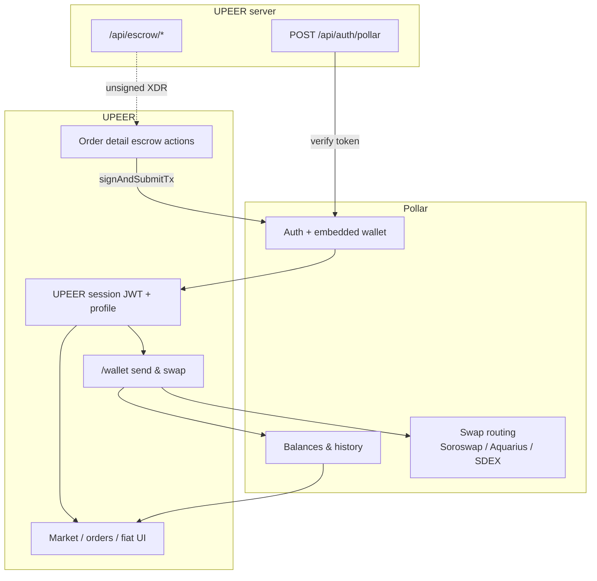
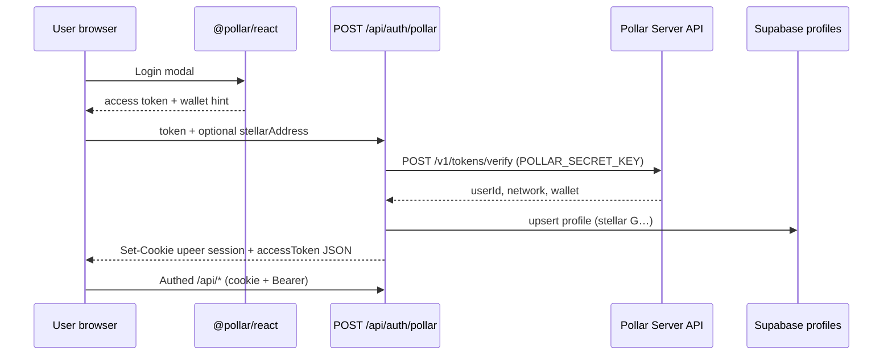
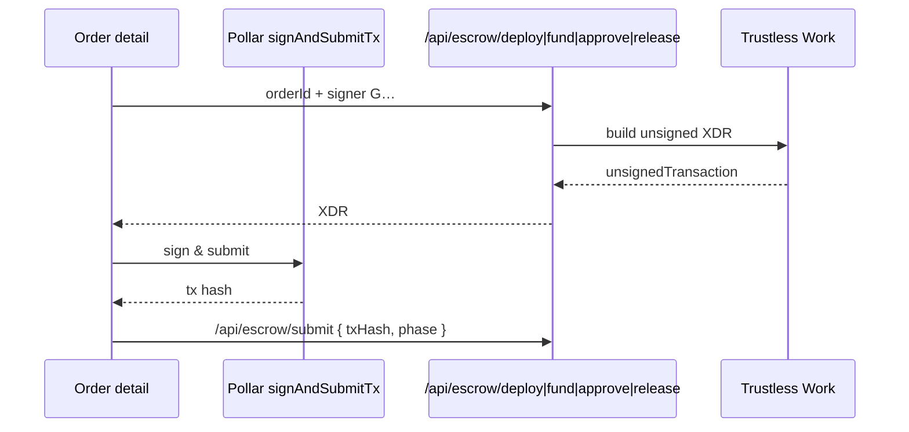
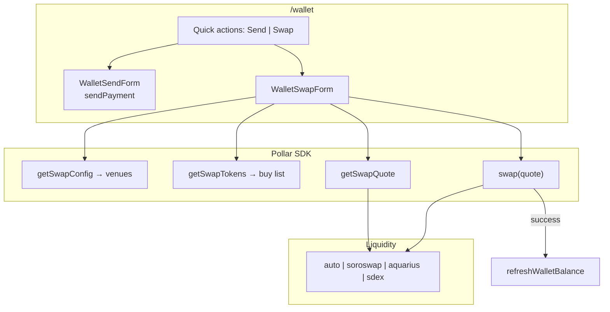
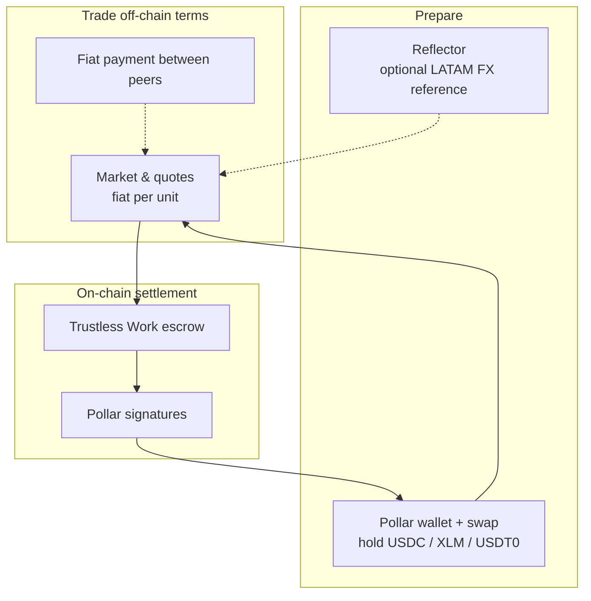

# Pollar in UPEER

[Pollar](https://docs.pollar.xyz/) is UPEER’s **identity and Stellar wallet layer**: embedded login, balances, send, receive, transaction history, and **swap** (Treasury → Swap venues). The order book does not convert USDC ↔ XLM ↔ USDT0; users fund the right settlement asset in `/wallet` (including swap) before they post or take trades.

Related: [Trustless Work](./integration-trustless-work.md) (escrow XDR signing), [Reflector](./integration-reflector.md) (server FX reads), [Architecture](./architecture.md).

## Role in the P2P model

| Capability | Where | P2P use |
| --- | --- | --- |
| Login | `PollarProvider`, login modal | Every authenticated flow |
| Stellar `G…` on profile | `POST /api/auth/pollar` → Supabase | Counterparty addresses, escrow roles |
| `signAndSubmitTx` | Order detail | Deploy / fund / approve / release escrow |
| `walletBalance` | `/wallet`, posting liquidity | Know available USDC/XLM/USDT0 |
| `sendPayment` | `/wallet` send | Optional transfers outside escrow |
| `getSwapQuote` + `swap` | `/wallet` swap | Get listing asset before trade |

## Session bridge (app auth)

Pollar access tokens never replace UPEER’s own session. The browser exchanges them once; the server verifies with the **secret** key.

Implementation: `components/providers/app-providers.tsx`, `lib/pollar/server.ts`, `lib/upeer-api.ts` (`exchangePollarSessionFromClient`).

Network on the Pollar app must match `STELLAR_NETWORK` / `NEXT_PUBLIC_STELLAR_NETWORK`.

## Escrow signing (with Trustless Work)

Trustless Work builds transactions server-side; Pollar is the **only** signer in the browser.

On-chain seller actions are gated in UI by `p2pLegs` + `wallet.address` (`use-order-detail.ts`).

## Wallet: send and swap

Swap is **client-side** through the Pollar SDK (not UPEER route handlers). Venues and buy tokens come from the Pollar dashboard (**Treasury → Swap**).

`lib/pollar/swap-assets.ts` maps Pollar tokens to Stellar asset refs (native XLM vs credit codes). If the user lacks a trustline for the buy asset, the UI offers **Create Trustline & Swap**. Smart (passkey) custody wallets skip swap until supported.

Swap supports **funding** for P2P; it is not invoked from `/trade/[offerId]`. Takers must already hold the offer’s `settlement_asset` (or acquire it via swap first).

## End-to-end: three integrations

1. **Reflector** — optional oracle reads for pricing context (`GET /api/prices/reference`).  
2. **Pollar** — who you are, what you hold, swap to the right asset, sign escrow.  
3. **Trustless Work** — escrow contract that releases the asset when the seller completes approve/release after fiat attestation.

## Configuration

| Variable | Purpose |
| --- | --- |
| `NEXT_PUBLIC_POLLAR_PUBLISHABLE_KEY` | Client `PollarProvider` |
| `POLLAR_SECRET_KEY` | Server token verify |
| `POLLAR_SERVER_URL` | Optional (default `https://server.api.pollar.xyz`) |

Pollar dashboard (not env): enabled assets, swap venues, buy tokens (e.g. USDT0 on mainnet).

Without the publishable key, `PollarRequired` surfaces a banner; escrow and wallet flows need login.
