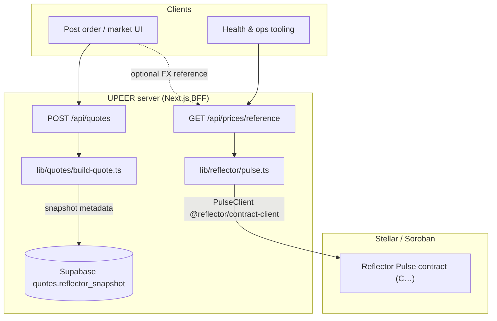
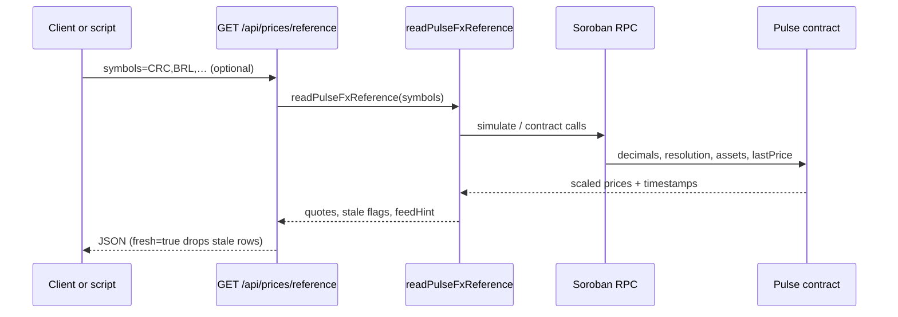
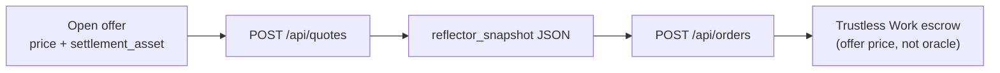
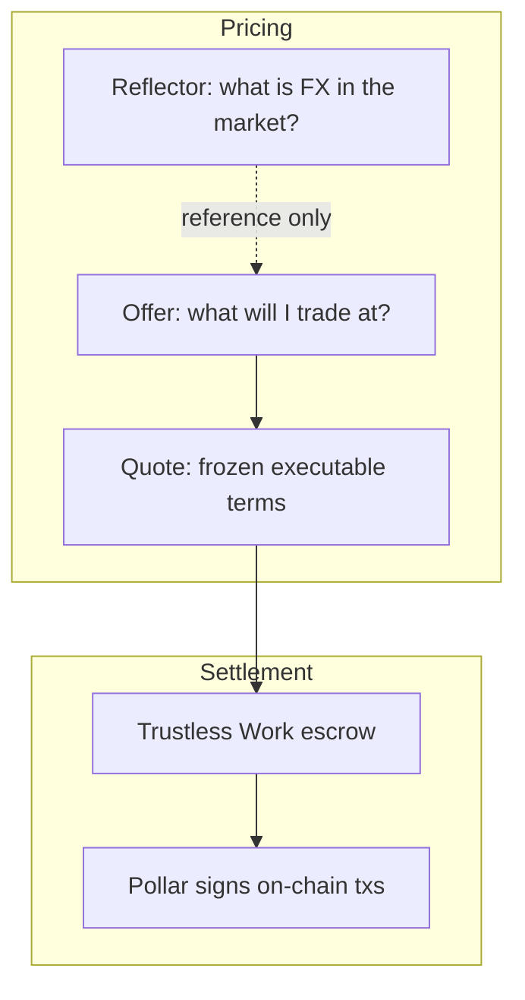

# Reflector Pulse in UPEER

[Reflector](https://reflector.network/) Pulse is an on-chain price oracle (Soroban contract). UPEER uses it as a **read-only LATAM FX reference** so makers and operators can anchor fiat pricing to external markets. Reflector does not sign transactions, hold funds, or settle trades.

Related: [Pollar](./integration-pollar.md) (wallets), [Trustless Work](./integration-trustless-work.md) (escrow), [Architecture](./architecture.md).

## Role in the P2P model

| Layer | What moves | Reflector’s part |
| --- | --- | --- |
| Fiat | Off-chain (PIX, Nequi, etc.) | Optional **reference** rate per LATAM currency |
| On-chain asset | USDC / XLM / USDT0 via Trustless Work escrow | None |
| Listing price | Maker-chosen **fiat per 1 unit** of settlement asset | Compare or document against oracle |

Executable trade prices always come from the **offer** and locked **quote** (`price_per_usdc`). Reflector informs pricing; it does not replace the order book.

## Data flow

## Read path (oracle)

`readPulseFxReference` loads contract metadata, filters to supported symbols (`DEFAULT_LATAM_SYMBOLS` in `lib/config/network.ts`), and marks quotes **stale** when older than the feed resolution (default 300s).

## Quote snapshots

When a taker requests a quote, the server persists a `reflector_snapshot` on the quote row for audit and UI display (`order-summary`, order detail).

Today `buildExecutableQuote` records `source: 'offer'` with the locked `pricePerUsdc` and `fiatCurrency`. The column name keeps room to attach live Reflector rows alongside the executable price later.

## Configuration

| Variable | Purpose |
| --- | --- |
| `REFLECTOR_PULSE_CONTRACT_ID` | Override Pulse contract (network defaults in `lib/config/network.ts`) |
| `REFLECTOR_RPC_URL` | Soroban RPC for oracle reads (defaults to app RPC) |
| `REFLECTOR_PUBLIC_KEY` | Simulation source account (`G…`); optional |

`GET /api/health` exposes `reflector.rpcUrl`, `contractId`, and `feedHint` (`fx` vs `dex_or_cex`) so deploys can confirm wiring without hitting the contract.

## Mental model

Reflector answers **reference** questions. Trustless Work + Pollar answer **settlement** questions.
