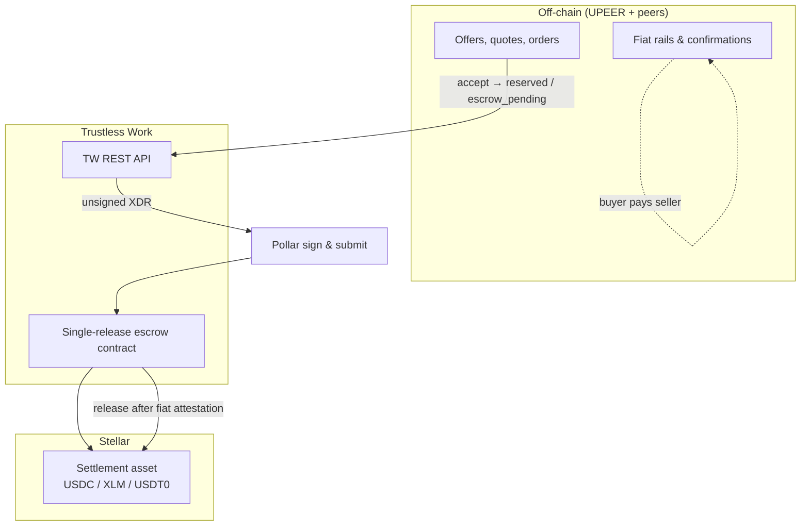
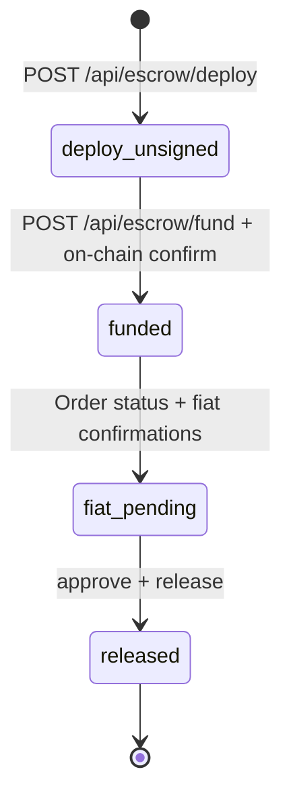
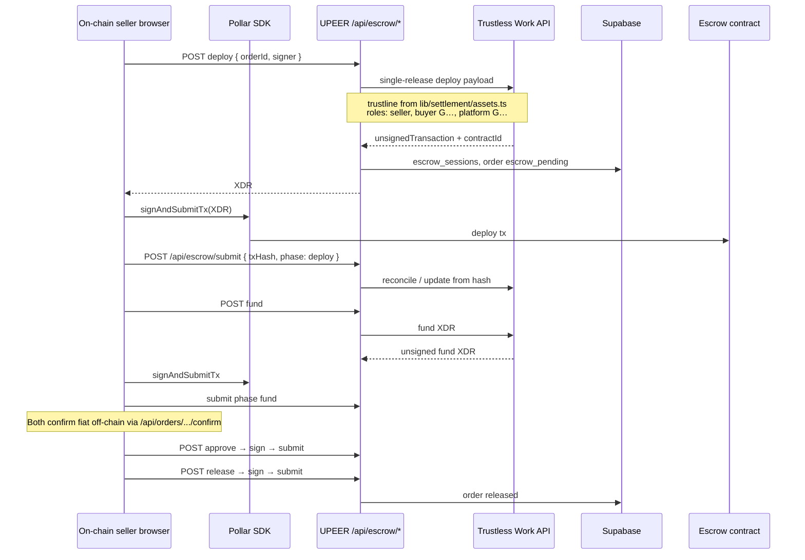
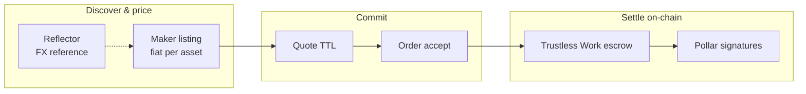

# Trustless Work in UPEER

[Trustless Work](https://www.trustlesswork.com/) provides **single-release Soroban escrow** for the on-chain leg of a P2P trade. UPEER’s server calls the Trustless Work API with an API key and returns **unsigned XDRs**. The on-chain seller signs with **Pollar** (`signAndSubmitTx`). Fiat payment stays off-chain between peers.

Related: [Pollar](./integration-pollar.md) (signing), [Reflector](./integration-reflector.md) (FX reference only), [How a trade works](./how-a-trade-works.md).

## Role in the P2P model

| Party | Off-chain | On-chain (TW) |
| --- | --- | --- |
| On-chain **seller** | May receive fiat | Deploy, fund, approve, release |
| On-chain **buyer** | Sends fiat, confirms | Receives asset on release |
| **UPEER platform** | Order state, notifications | `UPEER_PLATFORM_ADDRESS` as operator role in deploy |

Seller vs buyer follows listing **side** (`sell_usdc` / `buy_usdc`), not “who clicked first” — see `lib/escrow/p2p-legs.ts`.

## Escrow lifecycle

Deploy payload (simplified) ties each order to one settlement asset and engagement id:

- **Amount**: quote size in settlement asset  
- **Trustline**: issuer `G…` for USDC/USDT0, native SAC `C…` for XLM  
- **Roles**: seller as approver / service provider / release signer; buyer as receiver; platform as dispute resolver  
- **Fee**: `UPEER_PLATFORM_FEE_BPS` (default 50 bps)

## API surface (BFF)

| Route | Trustless Work action | Typical signer |
| --- | --- | --- |
| `POST /api/escrow/deploy` | Create escrow | On-chain seller |
| `POST /api/escrow/fund` | Lock trade amount | On-chain seller |
| `POST /api/escrow/submit` | Submit signed tx / wallet hash | Same |
| `POST /api/escrow/approve` | Approve milestone | On-chain seller |
| `POST /api/escrow/release` | Release to buyer | On-chain seller |
| `GET /api/escrow/status` | Poll milestone + on-chain | — |
| `POST /api/escrow/resolve` | Link contract if deployed elsewhere | — |
| `GET /api/escrow/probe` | API key + docs reachability | — |

Client orchestration lives in `components/orders/order-detail/use-order-detail.ts` (deploy, fund, approve+release chains).

## Configuration

| Variable | Purpose |
| --- | --- |
| `TRUSTLESS_WORK_API_KEY` | Server-only `x-api-key` for TW |
| `UPEER_PLATFORM_ADDRESS` | Stellar `G…` platform role on deploy |
| `UPEER_PLATFORM_FEE_BPS` | Optional fee basis points |
| `STELLAR_NETWORK` | Selects `dev.api.trustlesswork.com` vs production API |

`GET /api/health` reports whether the TW API key is set.

## How TW connects to Reflector and Pollar

- **Reflector** does not interact with Trustless Work.  
- **Pollar** does not call Trustless Work directly; UPEER’s BFF does, then Pollar only signs the returned XDRs.  
- After **release**, the buyer sees balances in `/wallet` (Pollar `walletBalance`).

Public escrow inspection: `trustlessWorkViewerUrl` in `lib/stellar/explorer.ts` (Trustless Work Escrow Viewer).
