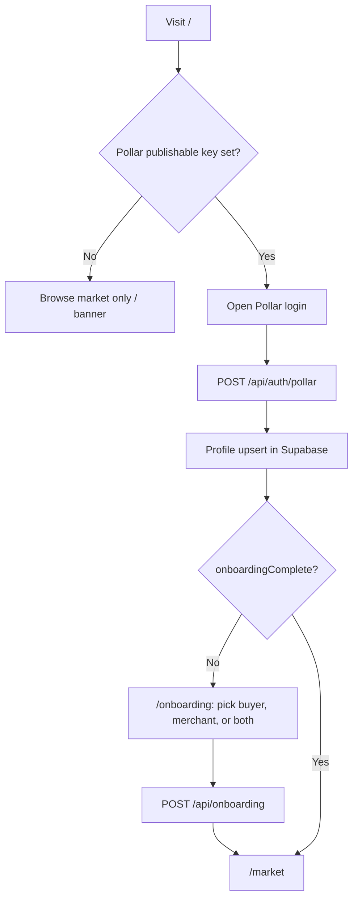
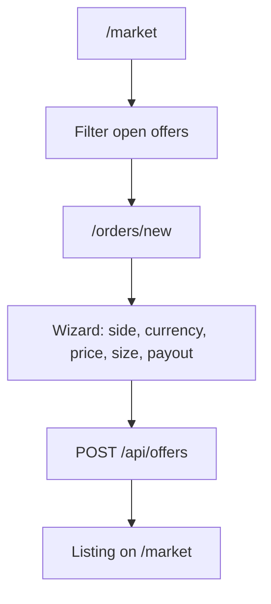
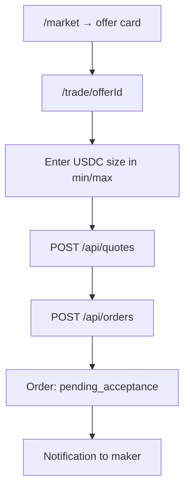
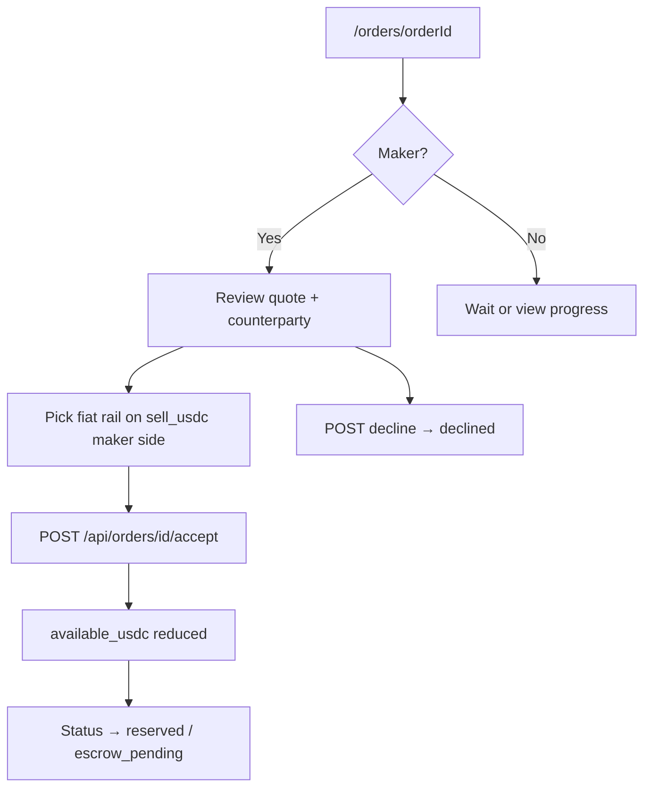
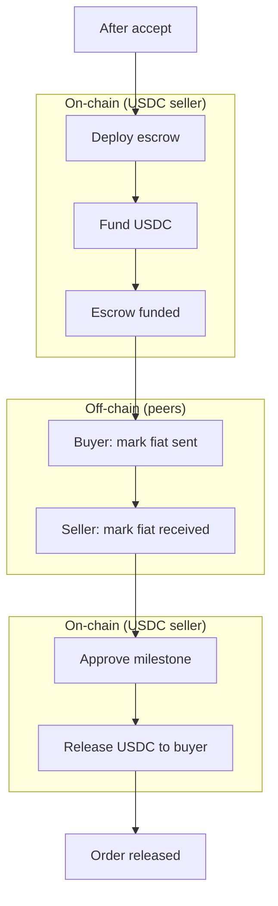
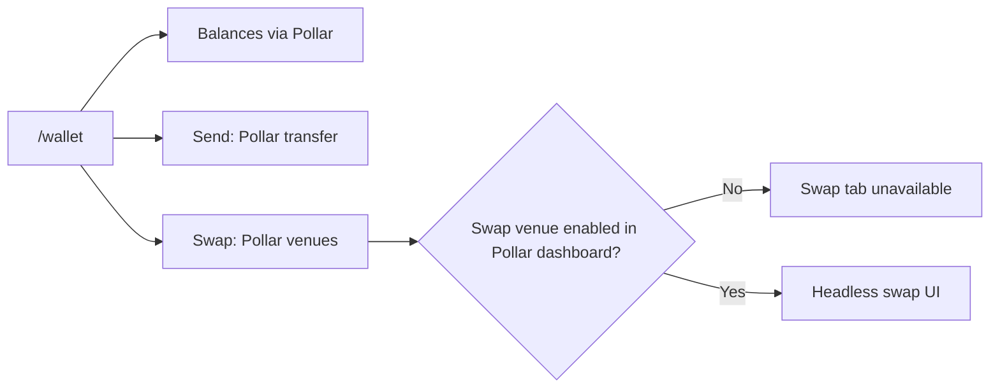
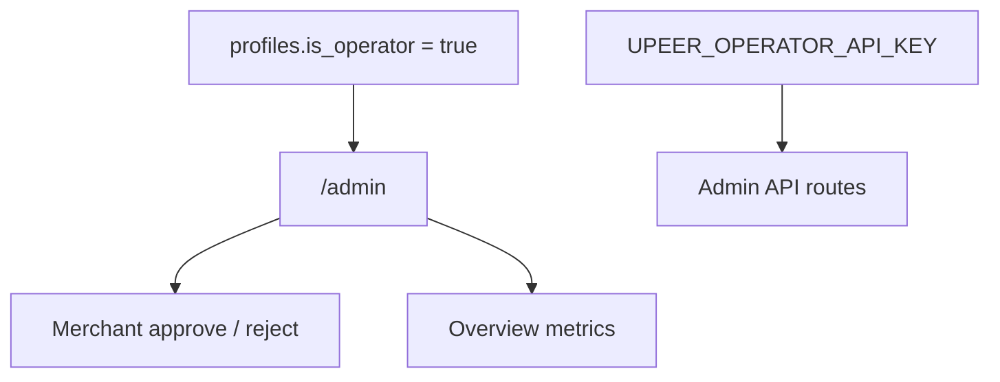

# User flows

Mermaid diagrams for the main journeys. Pair with [How a trade works](./how-a-trade-works.md) for manual test steps and [Architecture](./architecture.md) for APIs and integrations.

## Sign-in and onboarding

`OnboardingGate` (`components/session/onboarding-gate.tsx`) redirects authenticated users without onboarding to `/onboarding`.

## Browse and post (maker)

Verified merchants also use `/merchant` and `/dashboard` for desk tools. Any onboarded user can post if payout and prefs are valid.

## Take a trade (taker)

On `buy_usdc` listings the taker may be the USDC seller and selects a fiat receive method before submit.

## Maker accept and liquidity

Accept window: 24 hours from order creation or quote expiry, whichever is later (`lib/quotes/ttl.ts`).

## USDC escrow and fiat (both parties)

Fiat steps call `POST /api/orders/[id]/confirm` with role-specific payloads. Payment instructions come from the seller’s saved methods (`lib/profile/payment-prefs.ts`).

## Wallet (send and swap)

Swap is client-side through `@pollar/react`; UPEER does not proxy swap quotes on the server.

## Operator and admin

`POST /api/escrow/resolve` links an on-chain Trustless Work contract to the order when deploy happened outside the normal UI path.
